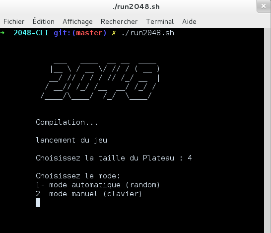
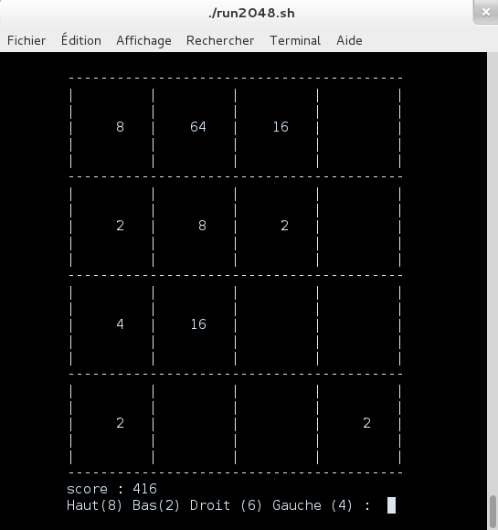

### 2048 MODE TERMINAL
### cours POO - UQAC

####Présentation
Mini projet dans le cardre du cours de Programmation Orientée Objet de l'UQAC (8INF957) avec Steven Fougeron et Yannis M'Rad.
Le programme étant en java il nécéssite java 1.7 (sun ou openjdk-7-jdk)

#### lancement
se placer dans le répertoire et taper
```bash
./run2048.sh
```
cette commande compilera le programme si besoin puis l'éxécutera.


-------------------
voici quelques screenshots du jeu:



